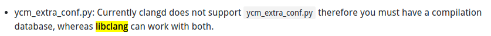
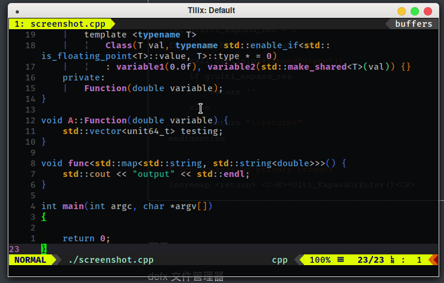
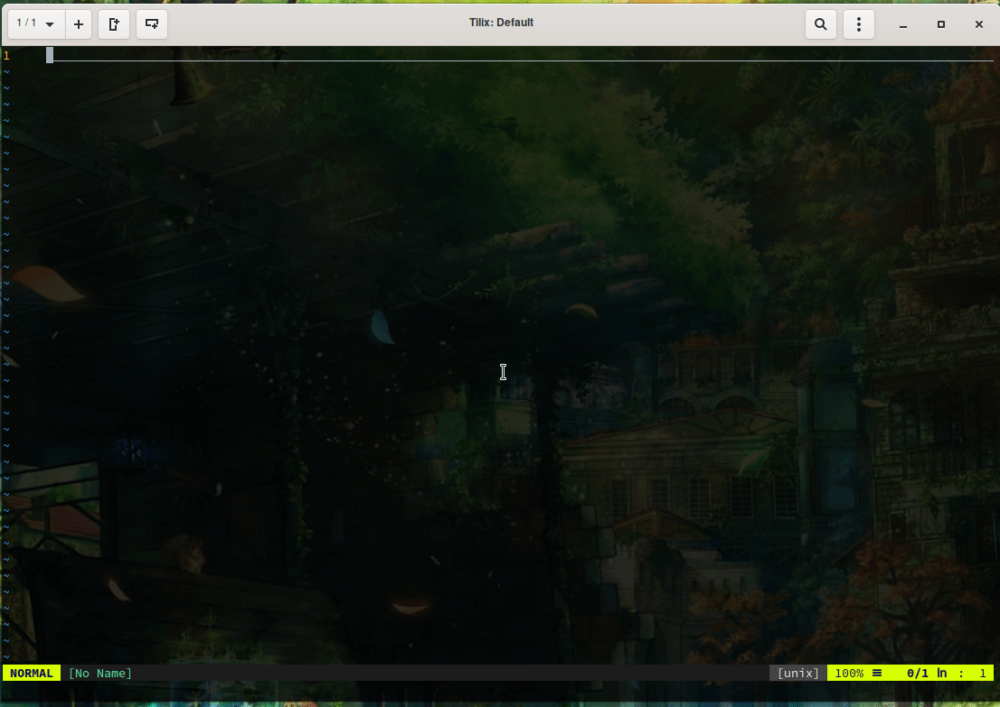
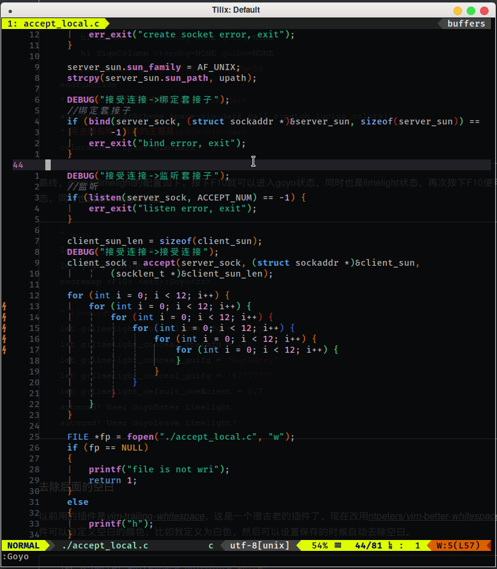
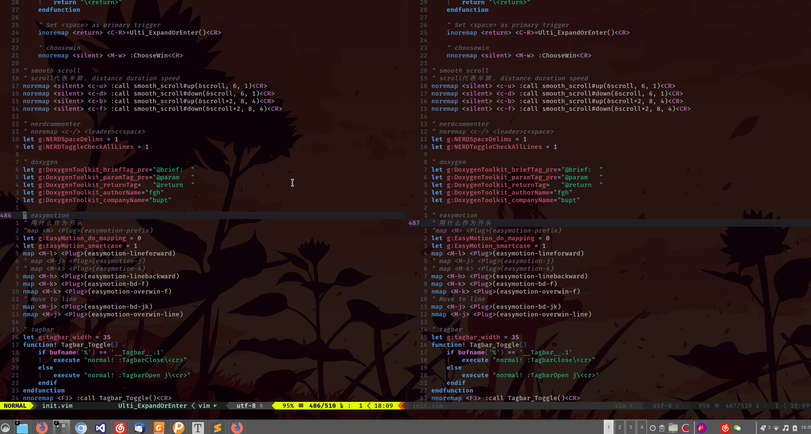
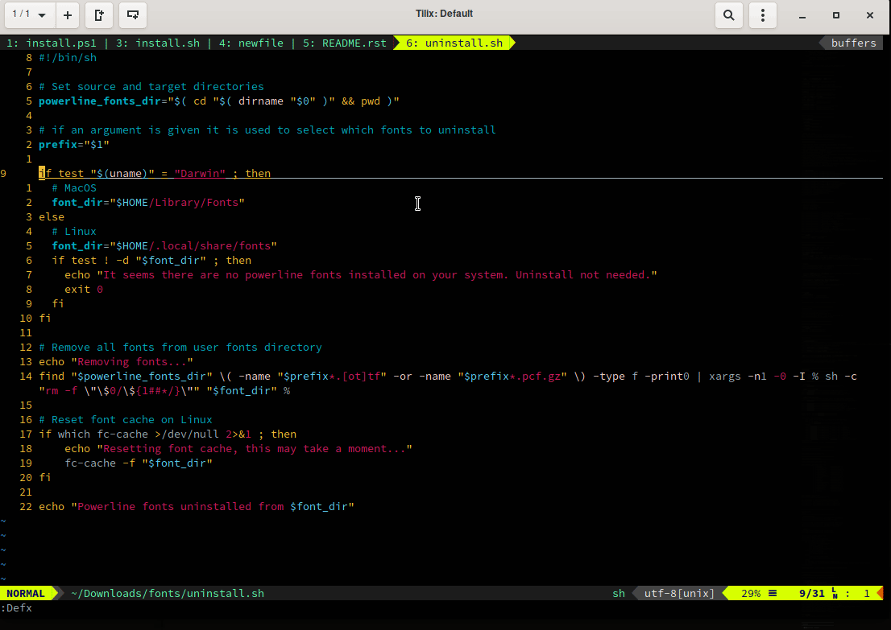
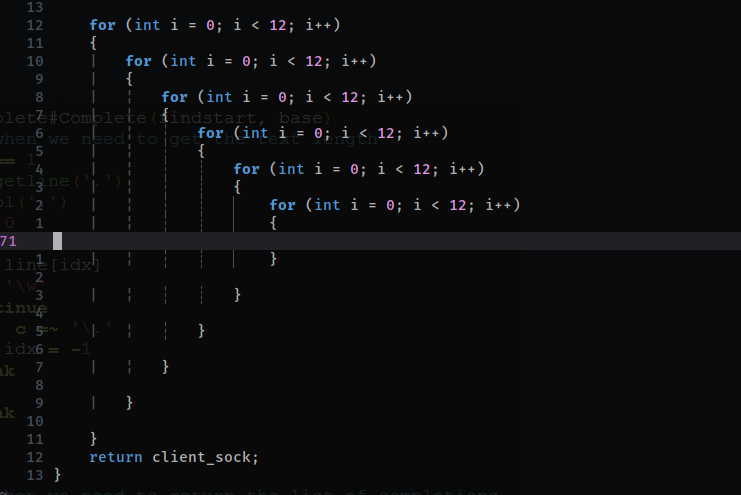
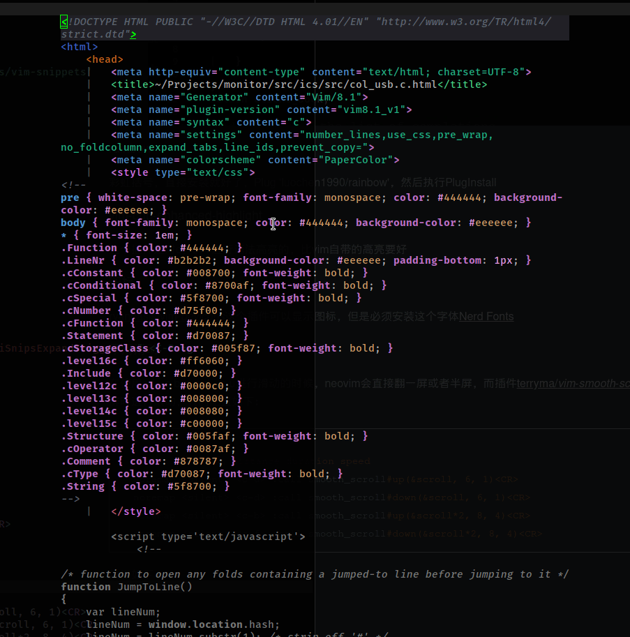

# vide

---

[TOC]

以前用vim，但是总感觉vim比neovim差点东西，而且以前的我喜欢大而全，将vim配置的特别豪华，各种语言都要支持，因此显得臃肿肥大速度也变慢了，有时候甚至配置出现了冲突。这次借着重装系统的机会尝试下neovim，我是被neovim的悬浮窗口吸引来的，然后重新配置一下，深刻理解下这些插件，不要让自己糊糊涂涂的了，

我将配置改成了模块化的方式，init.vim用于加载各种配置文件，所有的配置都在config下面，config/plugins是各种插件的配置，一个插件一个文件，这样管理起来方便，看起来舒心，配置起来随心所欲。


首先使用linux的包管理器安装neovim，与此同时，neovim中的很多插件需要python支持，因此需要通过pip 安装neovim，neovim的默认配置文件在~/.config/nvim/init.vim中。

之前配置的vim很复杂，基本上什么都有，什么乱七八糟的语言都支持，用了这么久之后发现，多了不一定好，我自己真正用到的其实也就那么几个，所以这个改用neovim想重新配置一下，主要是进行简配，觉得自己用的着的就配置上，之后用得着的之后再配。

~~我现在需要对汇编，c，c++，python，nodejs的支持，对于nodejs的需求没有那么强烈。能够有文件管理器，函数导航栏。~~

要想使用系统剪切板，那么安装一个xclip或者xsel然后在neovim中使用"+yy就可以与系统互通了。

## 安装

python-neovim，xsel（或者xclip）剪切板，python-send2trash，ctags

补全：clang,cmake,go,nodejs,npm,jdk

代码检查：nasm,gcc,cppcheck,clang,pylint,flake8,nvcc,javac,eslint,prettier

格式化：astyle autopep8；

安装nerd字体，来[这里](https://github.com/ryanoasis/nerd-fonts/releases/tag/v2.0.0)下载

安装带补丁的字体，执行下面的命令

```shell
git clone https://github.com/powerline/fonts.git
cd fonts
./install.sh
然后执行fc-cache -fv
```


## 安装插件管理器

这里使用vim-plug，对于neovim，直接运行下面的命令即可

```shell
curl -fLo ~/.config/nvim/autoload/plug.vim --create-dirs https://raw.githubusercontent.com/junegunn/vim-plug/master/plug.vim
```

这样，vim-plug就会安装在~/.config/nvim/autoload下面了，启动neovim的时候就能够自动启动vim-plug了。

## 安装插件

首先确定自己的插件要安装在哪里，然后在~/.config/nvim/init.vim中进行配置，我安装在～/.cache/nvim_plugins下面，这个目录是自定义的，然后在~/.config/nvim/init.vim中进行配置，如下：

```shell
call plug#begin('~/.cache/nvim_plugins')
" 插件都写在begin和end之间
call plug#end()
```

### 代码相关

#### 通用

##### 补全插件

###### ycm

补全插件使用[youcompleteme](https://github.com/Valloric/YouCompleteMe)，其他的补全插件还有oco.nvim、deplote.vim等。

在init.vim中添加Plug 'Valloric/YouCompleteMe'，然后执行PlugInstall等待youcompleteme安装完成。

安装完成之后，进入youcompleteme的下载目录（~/.cache/nvim_plugins/youcompleteme）执行下面的命令：

```shell
python3 ./install.py --clang-completer --go-completer --ts-completer --java-completer
```

以上命令添加了对c族语言的语义补全支持，添加了js语义补全支持，添加了go语义补全支持，添加了java语义补全支持，另外其还支持c#，但我用不到就先不添加了。

要想支持以上语言，必须安装clang，go，node，npm，jdk（要求jdk8，但是我安装的是最新版）

等编译完成即可。

对于ycm、ale与autoformat得好好看一下，这些需要仔细配置一下，现在先整ycm的c家族补全。

1. c/c++

   这个么，ycm文档说的，clang需要一系列的参数，如果clang不能解析我们的代码，那么ycm也就不能提供语义补全了。

   ycm的文档提供了两种方式进行语义补全，第一种是使用编译数据库，该方式可以很好的与ale进行配合，所以我打算使用这种方式。另一种方式便是使用.ycm_extra_conf.py配置文件了。

   使用编译数据库需要学会使用make或者cmake，由MakeFile或者CMakeLists.txt来生成compile_commands.json。

   **还是有点迷惑，不过这个方法挺好，ale也可以用，以后得好好学习一下[cmake](<https://www.hahack.com/codes/cmake/>)，现在暂时使用.ycm...吧**

   原来如此，原来编译的时候用的编译选项是--clangd-completor，而clangd不支持.ycm_extra_conf.py

   

   还能指定cuda，但是有个问题，怎么判断这个文件就是cuda的呢？？

   哈哈，可以了，重新编译了一下ycm，使用--clang-completer就可以支持.ycm_extra_conf.py了，而--clangd-completer不支持。好吧，cmake有点难，暂时先不搞，现在先用.ycm_extra_conf.py吧，不过推荐使用cmake，因为这样ale也可以使用了。哈哈，nice！！

   .ycm_extra_conf.py默认没有添加系统的头文件路径，可以自己加上，用-I，可以自动补全，用-isystem可以跳转头文件，所以都加上。

   ```python
       '-isystem', '/usr/include',
       '-isystem', '/usr/include/c++/8.3.0',
       '-I', '/usr/include',
       '-I', '/usr/include/c++/8.3.0',
   ```

   

2. python

   python 改成这个组合了

   ```viml
   Plug 'Shougo/deoplete.nvim', { 'do': ':UpdateRemotePlugins', 'for': ['python']}
   Plug 'Shougo/neopairs.vim', {'for': 'python'}
   Plug 'deoplete-plugins/deoplete-jedi', { 'for':'python' }
   ```

   这个比ycm好用，另外对于ale使用pylint和flake8，最好进入虚拟环境之后重新安装，这样ale就可以对代码进行检测了。

   首先应该先学会python的虚拟环境的使用，这样便于代码的移植，以前使用virtualenv，现在改用pipenv，一个更强大的虚拟环境工具，使用方法如下：

   ```shell
   1. 新建一个工程文件夹
   2. 建立一个.venv文件夹，不建立也可以，不建立的话默认的包都安装到~/.loacal/virtualenv下面，其实进入虚拟环境后包安装到哪里无所谓，主要是生成了Pipfile和Pipfile.lock，方便移植的时候知道需要哪些包哪些依赖。
   3. 使用命令pipenv --python 版本号来初始化当前文件夹
   4. 生成的Pipfile是用于描述安装了哪些包的，Pipfile.lock用于描述需要哪些依赖
   ```

   有时候因为源的问题，在lock依赖的时候会出现问题，因此在Pipfile中更还源，有如下可用源：

   ```shell
   阿里云：http://mirrors.aliyun.com/pypi/simple/ 
   豆瓣：http://pypi.douban.com/simple/ 
   清华大学：https://pypi.tuna.tsinghua.edu.cn/simple/ 
   中国科学技术大学：https://pypi.mirrors.ustc.edu.cn/simple/
   直接更改[[source]]下面的url即可
   ```

   ycm对在虚拟环境中进行补全，需要配置一下`.ycm_extra_conf.py`

   ```python
   def Settings(**kwargs):
    return {
           # python解释器路径
           'interpreter_path': './.venv/bin/python',
           # python包路径
           'sys_path': [
               './.venv/lib/python3.7/site-packages/package1',
               '/path/to/another/third_party/package2'
           ]
       }
   ```

   这样就差不多可以使用了，这里呢有个问题，那就是ale没法检测到虚拟环境，没法进行正确性检查，**一个很简单的方法便是进入虚拟环境操作，这样.ycm_extra_conf.py都可以不需要了**

   ```shell
   pipenv shell
   ```

   然后一切ok

   总结一下流程

   ```shell
   1. 新建一个工程文件夹
   2. 新建.venv文件夹
   3. 初始化虚拟环境，执行`pipenv --python python版本`
   4. 使用pipenv install 安装所需要的包
   5. 执行pipenv lock写入依赖
   6. 执行pipenv shell进入虚拟环境，要想在虚拟环境中使用nvim，需要pipenv install neovim，同时为了能够使用ale检查，需要pipenv install pylint flake8哈哈哈
   7. 开心的coding吧
   ```

3. JavaScript

   js或者ts使用的是tsserver，需要在工程目录下添加一个文件jsconfig.json（json工程）或者tsconfig.json（ts工程）。

   ```js
   {
       "compilerOptions": {
           "checkJs": true		// 可以诊断js
       }
   }
   ```

   参考的是vscode的配置方法，[jsconfig.json](https://code.visualstudio.com/docs/languages/jsconfig)

   jsconfig.json所在目录即为工程根目录，一个大项目中可以有多个jsconfig.json，例如：

   ```shell
   website
   ├── client
   │   ├── client.js
   │   └── jsconfig.json
   └── server
       ├── jscofig.json
       └── server.js
   ```

   一些参数：

   ```json
   // exclude, 排除
   // 如果觉得速度慢了，建议写排除
   {
       "compilerOptions": {
           "target": "es6"
       },
       "exclude": [
           "node_modules"
       ]
   }
   // include, 包含
   // 默认包含当前目录下的所有文件包括子文件夹的文件
   // 写上include之后只包含include中的文件
   {
       "compilerOptions": {
           "target": "es6"
       },
       "include": [
           "src/**/*"
       ]
   }
   // include 和 exclude的路径配置都是相对于jsconfig.json文件的
   ```

   编译选项：

   | 选项                         | 描述                                                         |
   | ---------------------------- | ------------------------------------------------------------ |
   | noLib                        | 不包含默认库文件                                             |
   | target                       | 明确使用哪一个库文件，可选："es3", "es5", "es6", "es2015", "es2016", "es2017", "es2018", "esnext". |
   | checkjs                      | 开启js的类型检查                                             |
   | experimentalDecorators       | Enables experimental support for proposed ES decorators.     |
   | allowSyntheticDefaultImports | Allow default imports from modules with no default export. This does not affect code emit, just type checking. |
   | baseUrl                      | Base directory to resolve non-relative module names.         |
   | paths                        | Specify path mapping to be computed relative to baseUrl option. |

   可以使用webpack别名：

   ```json
   {
     "compilerOptions": {
       "baseUrl": ".",
       "paths": {
           // 别名：路径，使用的时候可以直接import 一些东西 from 别名/xxx
         "ClientApp/*": ["./ClientApp/*"]
       }
     }
   }
   
   // 然后在文件中
   import Something from 'ClientApp/foo'
   ```

   建议nodejs添加exclude，去除node_modules

   我的ale是这么配置的呀！`'javascript': ['prettier', 'eslint']`，用eslint的话必须eslint --init对当前文件夹进行初始化，emm，我看看用或者不用eslint效果怎么样，prettier怎么样好像是格式化和修复的，先这样看看吧，eslint好像很厉害，删除prettier了。

   体验非常好。

   通过一下流程进行项目开发：

   ```shell
   # 跟python的pipenv一样，npm也有两个文件，一个package.json用于描述该项目用到了哪些module，package-lock.json则用于模块的依赖，跟pipenv差不多，pipenv的Pipfile用于描述模块，Pipfile.lock用于描述依赖
   1. 首先新建一个文件夹，我们的工程文件夹
   2. 接着npm init用于生成package.json
   3. 接着安装需要的模块就好了，需要npm install module --save这样可以保存依赖到package.json的depencies中，自动更新package.json
   4.  接着eslint --init用于ale的差错检测
   5. 配置一下jsconfig.json文件
   6. npm嫌慢的话可以配置一下`npm config set registry https://registry.npm.taobao.org`
   现在就可以使用了
   ```
```
   
   Nice!!

###### coc

这个插件好像很厉害，暂时先不用，先用ycm吧

##### 语法检查

~~syntastic是一个很古老的工具，现在不使用了~~。

语法检查使用的是[ale](https://github.com/w0rp/ale)，该工具是一个异步语法检查工具，我还没整明白什么是linters，所以什么fix特性就先不整了，直接安装让他有代码错误提示就行了。

在init.vim中添加Plug 'w0rp/ale'，然后执行PlugInstall命令安装。

之后需要进行配置，这个linter好像不同的语言需要不同的配置，~~一些linter好像在ale中内置了，不需要单独安装~~，应该是需要单独安装的。具体配置如下：

​```shell
    let g:ale_linter_aliases = {'vue': ['css', 'javascript', 'typescript']}
    let g:ale_linters = {
                \   '*': ['remove_trailing_lines', 'trim_whitespace'],
                \   'asm': ['gcc'],
                \   'nasm': ['nasm'],
                \   'c': ['cppcheck', 'clang'],
                \   'cpp': ['cppcheck', 'clang'],
                \   'cmake': ['cmake-format'],
                \   'python': ['pylint', 'flake8'],
                \   'cuda': ['nvcc'],
                \   'go': ['gofmt'],
                \   'java': ['javac'],
                \   'javascript': ['eslint'],
                \   'shell': ['shell -n flag'],
                \   'lua': ['luac'],
                \   'yaml': ['prettier'],
                \   'latex': ['alex'],
                \   'vue': ['eslint'],
                \ }
```

[支持列表](https://github.com/w0rp/ale/blob/master/supported-tools.md)这里可以看到ale所支持的语言。

研究生要学习cuda了，所以添加cuda，其他的c，c++就用clang了，python就用flake8吧，然后java用javac，js用eslint，latex后面再说，我对他还不是很了解，但是老师要求以后写论文都要用latex。

这些linter需要单独安装，安装clang，jdk，cuda，flake8，prettier，eslint。

> arch 下面安装cuda之后找不到nvcc，查看arch wiki才发现cuda安装到/opt/cuda下面了，nvcc在/opt/cuda/bin下面，需要将/opt/cuda/bin添加到PATH中。

总之，这个ale还不是很明白，先做个标记吧。

cppcheck很厉害啊，可以检查bug而不是语法错误。

##### 代码片段

使用这个插件[SirVer/*ultisnips*](https://github.com/SirVer/ultisnips)，而且该插件向来与该插件[honza/*vim*-snippets](https://github.com/honza/vim-snippets)配合作，直接安装，配置快捷键。不过这货居然跟ycm冲突了，ultisnips使用的是tab按键进行扩展，而ycm使用的是tab来进行选择，我们需要更改ultisnips的快捷键值了，我从作者的[issue](https://github.com/SirVer/ultisnips/issues/512)里面找了一个配置，~~加进来了，使用ctrl enter来进行扩展~~。

这个废弃了，看后面有更吊的配置，如果ycm能显示snip，那么直接回车就好了。

```shell
" ultisnips
let g:UltiSnipsSnippetsDir = '~/.cache/nvim_plugins/vim-snippets'
"let g:UltiSnipsEditSplit="heroize"
let g:UltiSnipsExpandTrigger       = "<C-R>"
let g:UltiSnipsJumpForwardTrigger  = "<tab>"
let g:UltiSnipsJumpBackwardTrigger = "<s-tab>"

" Enable tabbing through list of results
function! g:UltiSnips_Complete()
    call UltiSnips#ExpandSnippet()
    if g:ulti_expand_res == 0
        if pumvisible()
            return "\<C-n>"
        else
            call UltiSnips#JumpForwards()
            if g:ulti_jump_forwards_res == 0
               return "\<TAB>"
            endif
        endif
    endif
    return ""
endfunction

au InsertEnter * exec "inoremap <silent> " . g:UltiSnipsExpandTrigger . " <C-R>=g:UltiSnips_Complete()<cr>"

" Expand snippet or return
let g:ulti_expand_res = 0
function! Ulti_ExpandOrEnter()
    call UltiSnips#ExpandSnippet()
    if g:ulti_expand_res
        return ''
    else
        return "\<return>"
endfunction

" Set <space> as primary trigger
inoremap <return> <C-R>=Ulti_ExpandOrEnter()<CR>
```



最新的，来自[这里](https://github.com/Valloric/YouCompleteMe/issues/420#issuecomment-55940039)，测试了一下，原来这个功能是当出现提示列表的时候，无论你选中的是不是snip中的内容，按回车只要snip中有就补全，好吧更改快捷键了，不适用tab了，改用c l 和 c h了分别表示下一个和上一个。原来的c l c h切换buffer改成使用leaderf的了，先这样吧。

##### 代码注释

代码注释一般是使用[scrooloose/*nerdcommenter*](https://github.com/scrooloose/nerdcommenter)这个插件。

这个挺好用的，他有一个快捷键 leader c space 这样子的，可以智能注释与反注释，我想将这个快捷键绑定到ctrl /上，但是没有成功，我就是这么绑定的`noremap <c-/> <leader>c<space>`，不知道为什么不可以。那还是用它自带的快捷键吧，leader c表示启动注释，然后后面在跟上相应的功能。

首先要知道切换，leader a可以在// 与 /*  */之间进行切换。

```shell
leader c c 对选中区域进行注释，只能注释
leader c A 在一行最后注释，只能注释
leader c l 只能注释，不过注释对齐了
leader c b 只能注释，不过注释对齐了
leader c i 可以注释也可以取消注释，未对齐
leader c s 用这种方式进行注释
/*
 * coding...
 * coding...
 */
leader c m 用这种方法进行注释
/*coding....
  coding */
leader c u 撤销注释
```

我还是喜欢对其的，leader l或者leader c b，然后撤销使用leader c u，有时候使用leader c s

##### DoxygenToolkit

这个插件是一个函数注释生成插件，支持c c++ python。

不配置快捷键了，因为不是经常使用，只有在函数开头才用，所以直接用命令：Dox即可，

同时还有DoxAuthor来输入作者信息，一般在文件开头。

DoxLic来输入许可证信息，一般在文件开头。

先这么用着吧。

##### 代码格式化

格式化代码使用的是[Chiel92/vim-*autoformat*](https://github.com/Chiel92/vim-autoformat)这个工具，直接安装，然后不同的语言需要不同的后端，astyle支持c，c++，java，c#，autopep8支持python，同时ale也可以改用autopep8了，js使用eslint，然后json, html，css，sql啥的暂时先不管了。

js,json使用js-beautify

这里主要是说的是，autoformat安装完成后就会自动去检查相应的格式化工具，调用默认的格式化方法，而我们想定制的话就要按照下面的这种方法来，贴一段作者的介绍：

```shell
The formatprograms that available for a certain <filetype> are defined in g:formatters_<filetype>. This is a list containing string identifiers, which point to corresponding formatter definitions. The formatter definitions themselves are defined in g:formatdef_<identifier> as a string expression. Defining any of these variable manually in your .vimrc, will override the default value, if existing. For example, a complete definition in your .vimrc for C# files could look like this:

let g:formatdef_my_custom_cs = '"astyle --mode=cs --style=ansi -pcHs4"'
let g:formatters_cs = ['my_custom_cs']

In this example, my_custom_cs is the identifier for our formatter definition. The first line defines how to call the external formatter, while the second line tells vim-autoformat that this is the only formatter that we want to use for C# files. Please note the double quotes in g:formatdef_my_custom_cs. This allows you to define the arguments dynamically:

let g:formatdef_my_custom_cs = '"astyle --mode=cs --style=ansi -pcHs".&shiftwidth'
let g:formatters_cs = ['my_custom_cs']

Please notice that g:formatdef_my_custom_cs contains an expression that can be evaluated, as required. As you see, this allows us to dynamically define some parameters. In this example, the indent width that astyle will use, depends on the buffer local value of &shiftwidth, instead of being fixed at 4. So if you're editing a csharp file and change the shiftwidth (even at runtime), the g:formatdef_my_custom_cs will change correspondingly.
```

下面是我的配置，对于c、c++、python的，其他的用到了再说，[clang-format](http://clang.llvm.org/docs/ClangFormatStyleOptions.html)参数说明，[astyle](http://astyle.sourceforge.net/astyle.html#_Quick_Start)使用说明，[autopep8](https://pypi.org/project/autopep8/)，现在也没人要求我用什么格式，所以我就按自个觉得好看的来了。嘿嘿嘿！！

```shell
autocmd FileType vim,tex let b:autoformat_autoindent=0
" let g:autoformat_autoindent = 1
" let g:autoformat_retab = 0
" let g:autoformat_remove_trailing_spaces = 1
"
" 可以自定义格式化命令,
" my_custom_cs是标签，表示一个命令，formatters_cs = []表示使用my_custom_cs对c#进行格式化
" 其中cs表示文件类型，c cpp py js
" let g:formatdef_my_custom_cs = '"astyle --mode=cs --style=ansi -pcHs".&shiftwidth'
" let g:formatters_cs = ['my_custom_cs']
let g:formatdef_my_custom_c = '"astyle --mode=c --style=allman"'
let g:formatters_c = ['my_custom_c']
let g:formatdef_my_custom_h = '"astyle --mode=c --style=allman"'
let g:formatters_h = ['my_custom_h']
let g:formatdef_my_custom_cpp = '"astyle --style=mozilla"'
let g:formatters_cpp = ['my_custom_cpp']
let g:formatdef_my_custom_hpp = '"astyle --style=mozilla"'
let g:formatters_hpp = ['my_custom_hpp']

let g:formatdef_my_custom_py = '"autopep8 --in-place --aggressive"'
let g:formatters_py = ['my_custom_py']
let g:formatdef_my_custom_java = '"astyle --mode=java --style=java"'
let g:formatters_java = ['my_custom_java']
let g:formatdef_my_custom_js = '"astyle --mode=java --style=java"'
let g:formatters_js = ['my_custom_js']
```


#### asm

#####  二进制编辑工具

[Shougo/vinarise.*vim*](https://github.com/Shougo/vinarise.vim)这个是二进制编辑工具，不过作者说不在维护了只修复bug，然后开发了新的插件[Deorise.nvim](https://github.com/Shougo/deorise.nvim)，但是这个仓库还没有开放呢～～


#### c/c++

##### 配色

[octol/vim-*cpp*-enhanced-highlight](https://github.com/octol/vim-cpp-enhanced-highlight)这个工具可以让cpp文件的配色更适合敲代码

#### python

#### js

#### java

#### latex

### 工具

#### git版本控制

这个得先熟悉git怎么用才行。

#### ×文本块操作


#### defx 文件管理器

之前一直使用[vimfiler](https://github.com/Shougo/vimfiler.vim)，但是这个插件需要安装unite，作者现在已经不维护这个插件了，他推荐使用[defx](https://github.com/Shougo/defx.nvim)，好吧，这个插件不需要安装unite了，直接安装这一个插件就可以使用了。

在init.vim文件中添加 Plug 'Shougo/defx.nvim', { 'do': ':UpdateRemotePlugins' }，然后执行PlugInstall，等待安装成功之后就可以使用了，但是这个插件是需要配置才更好用的，从网上搜了好多都没有搜到怎么配置，作者的[doc](https://github.com/Shougo/defx.nvim/tree/master/doc)里面有一个介绍，如何使用defx，同时我也参考了spacevim中的一部分配置，自己瞎作了一下就可以用了，跟我之前使用vimfiler一样的感觉。配置如下，可以直接丢到init.vim中用：

```shell
nnoremap <F2> <esc>:Defx<cr>	" 按F2打开关闭defx
call defx#custom#option('_', {  " 比如文件管理器窗口的宽度，显示方式等在这里配置
      \ 'winwidth': 30,			
      \ 'split': 'vertical',
      \ 'direction': 'leftabove',
      \ 'show_ignored_files': 0,
      \ 'buffer_name': '',
      \ 'toggle': 1,
      \ 'resume': 1
      \ })

call defx#custom#column('filename', { 
      \ 'directory_icon': '▸',
      \ 'opened_icon': '▾',
      \ 'root_icon': ' ',
      \ 'min_width': 40,
      \ 'max_width': 40,
      \ })

call defx#custom#column('mark', {
      \ 'readonly_icon': '✗',
      \ 'selected_icon': '✓',
      \ })

autocmd FileType defx call s:defx_my_settings()
function! s:defx_my_settings() abort
  nnoremap <silent><buffer><expr> '
        \ defx#do_action('toggle_select') . 'j'  " '选中并移动到下一行
  nnoremap <silent><buffer><expr> *
        \ defx#do_action('toggle_select_all')
  nnoremap <silent><buffer><expr> X              " 使用系统默认软件打开
        \ defx#do_action('execute_system')
  nnoremap <silent><buffer><expr> yy			 " 复制一个文件或者文件夹
        \ defx#do_action('copy')
  nnoremap <silent><buffer><expr> q				  " 退出"
        \ defx#do_action('quit')
  nnoremap <silent><buffer><expr> m				  " 移动"
        \ defx#do_action('move')
  nnoremap <silent><buffer><expr> p               " 粘贴"
        \ defx#do_action('paste')
  nnoremap <silent><buffer><expr> h               " hjkl 四个方向键可以自己探索了"
        \ defx#is_opened_tree() ?
        \ defx#do_action('close_tree') : defx#do_action('cd', ['..'])
  nnoremap <silent><buffer><expr> l 
        \ defx#do_action('call', 'DefxSmartL')
  nnoremap <silent><buffer><expr> o 
        \ defx#do_action('call', 'DefxSmartL')
  nnoremap <silent><buffer><expr> <Cr>
        \ defx#is_directory() ?
        \ defx#do_action('open_directory') : defx#do_action('drop')
  nnoremap <silent><buffer><expr> <2-LeftMouse>
        \ defx#is_directory() ?
        \ defx#do_action('open_tree') : defx#do_action('drop')
  nnoremap <silent><buffer><expr> sv				" 垂直分割打开一个新的窗口，文件将在这里展示"
        \ defx#do_action('drop', 'vsplit')
  nnoremap <silent><buffer><expr> sh				" 水平分割"
        \ defx#do_action('drop', 'split')
  nnoremap <silent><buffer><expr> S                	" 排序"
        \ defx#do_action('toggle_sort', 'time')
  nnoremap <silent><buffer><expr> st				" 打开一个新的tab来编辑"
        \ defx#do_action('drop', 'tabedit')
  nnoremap <silent><buffer><expr> P
        \ defx#do_action('open', 'pedit')
  nnoremap <silent><buffer><expr> N					" 新建一个文件/文件夹， 名字后面带/ 表示文件夹"
        \ defx#do_action('new_file')
  nnoremap <silent><buffer><expr> dd
        \ defx#do_action('remove')
  nnoremap <silent><buffer><expr> r
        \ defx#do_action('rename')
  nnoremap <silent><buffer><expr> .					" 显示隐藏文件"
        \ defx#do_action('toggle_ignored_files')
  nnoremap <silent><buffer><expr> ~
        \ defx#do_action('cd')
  nnoremap <silent><buffer><expr> !  
        \ defx#do_action('execute_command')
  nnoremap <silent><buffer><expr> j
        \ line('.') == line('$') ? 'gg' : 'j'
  nnoremap <silent><buffer><expr> k
        \ line('.') == 1 ? 'G' : 'k'
  nnoremap <silent><buffer><expr> <C-r>
        \ defx#do_action('redraw')
  nnoremap <silent><buffer><expr> <C-g>
        \ defx#do_action('print')
  nnoremap <silent><buffer><expr> cd
        \ defx#do_action('change_vim_cwd')
endf

" in this function we should vim-choosewin if possible
function! DefxSmartL(_)
  if defx#is_directory()
    call defx#call_action('open_tree')
    normal! j
  else
    let filepath = defx#get_candidate()['action__path']
    if tabpagewinnr(tabpagenr(), '$') >= 3    " if there are more than 2 normal windows
      if exists(':ChooseWin') == 2
        ChooseWin
      else
        if has('nvim')
          let input = input({
                \ 'prompt'      : 'ChooseWin No.: ',
                \ 'cancelreturn': 0,
                \ })
          if input == 0 | return | endif
        else
          let input = input('ChooseWin No.: ')
        endif
        if input == winnr() | return | endif
        exec input . 'wincmd w'
      endif
      exec 'e' filepath
    else
      exec 'wincmd w'
      exec 'e' filepath
    endif
  endif
endfunction

```

上面是defx的配置，可以直接拿来用了，效果如下：




#### leaderf

这也是一个很厉害的工具，模糊搜索，不过neovim出来悬浮窗口了，我觉得这个工具跟悬浮窗口组合一下会相当好用的。

Plug 'Yggdroot/LeaderF', { 'do': './install.sh' }，然后执行PlugInstall安装leaderf

默认的快捷键是<leader> f 打开文件搜索框，<leader> b 打开buffer搜索框，然后稍微配置了一下

```shell
nnoremap <leader>t :LeaderfBufTag<CR>
nnoremap <leader>T :LeaderfBufTagAll<CR>
nnoremap <leader>l :LeaderfLine<CR>
nnoremap <leader>L :LeaderfLineAll<CR>
```

这样可以使用<leader>t 打开当前buf的tag，<leader>T可以打开当前所有buf的tag了，感觉可以代替tagbar了，我不打算安装tagbar了。

算了，在我这里应该改成叫altf，哈哈哈，全都改成alt按键了，把leader省出来给easymotion。

不过据我观察好像这个leaderf的使用频率不如easymotion，所以我想把leaderf改成leader，然后easymotion使用alt。

权衡了一下改成了下面这样子

```shell
"leaderf
nnoremap <leader>f :LeaderfFile<CR>
nnoremap <M-t> :LeaderfBufTag<CR>
nnoremap <M-T> :LeaderfBufTagAll<CR>
nnoremap <M-b> :LeaderfBuffer<CR>
nnoremap <M-s> :LeaderfLine<CR>
nnoremap <M-S> :LeaderfLineAll<CR>
highlight Lf_hl_match gui=bold guifg=Red cterm=bold ctermfg=21
highlight Lf_hl_matchRefine  gui=bold guifg=Magenta cterm=bold ctermfg=201
```

leader f用于搜索文件，然后其他的依然是alt，后面配置一下easymotion，尽可能让常用的功能用alt和ctrl完成。

总结一下吧，这个leaderf和easymotion有点混乱，leaderf的模糊搜索很厉害，我把alt + s定义为搜索（search），搜索每一行，alt + S则是搜索所有buffer的每一行。alt t则表示tags，alt b则表示buffers

在easymotion中，alt hjkl分别表示向某一方向移动，不过我觉得jk不太常用，到时hl很常用，让alt f（find）多窗口搜索一个字母，alt + L多窗口跳转行，反正jk不是很常用，直接将alt j改成行吧，既然这样，alt k留着没用，让他代替f吧，alt k表示按字母搜托跳转吧。

#### auto-pairs

括号自动补全，安装就完事了，这个也不用配置什么东西，alt n跳出括号。

#### vim-surround

这个插件可以给单词围上一个符号或者更改包围某个单词的符号为另一个符号。

主要是怎么用，作者在github给出了用法。

```shell
cs"'
这个意思是change surround \" \',就是将 \" 改成 \'
cs'<q>
这个的意思是 change surround ' to <q>，就是将'改成<q> </q>
cst'
这个的意思是将<q>hello world</q>的tag <q> </q>改成'
ds"
意思是delete surround "
dst
明显，这个的意思便是删除tag了

对于添加则是使用ys，ys + 范围 + 符号，这个范围可以是iw，表示一个单词，s表示一行

对于任意范围的添加，则在V模式下选择之后直接S+符号即可
```

#### goyo

一个可以让你专注阅读的工具，废话不多说，直接安装即可。Plug 'junegunn/goyo.vim'。这个可以搭配limelight使用，不过goyo在退出时主题就不透明了不知道为什么。

在作者的issue中找到了答案，原来，goyo在退出的时候会重新加载主题但是他不会加载你自己在配置文件中配置的主题内容，进行如下更改便可以了。

```shell
function! s:patch_lucius_colors()
	" 这部分是你自己的配置，我的配置如下
    set termguicolors
    hi Normal     ctermbg=NONE guibg=NONE
    hi LineNr     ctermbg=NONE guibg=NONE
    hi SignColumn ctermbg=NONE guibg=NONE
    hi Comment guifg=#5C6370 ctermfg=59
endfunction
" 写主题名称，我用的主题是space-vim-dark
autocmd! ColorScheme space-vim-dark call s:patch_lucius_colors()
" 写主题名称，我用的主题是space-vim-dark
colorscheme space-vim-dark
```

最终，goyo与limelight的配置如下，按下F10就可以进入goyo状态，同时也是limelight状态，再次按下F10便可退出goyo状态，同时也退出limelight状态

```shell
" goyo
let g:goyo_width = '80'
let g:goyo_height = '90%'
nnoremap <F10> <esc>:Goyo<cr>

" limelight
let g:limelight_conceal_ctermfg = 'gray'
let g:limelight_conceal_ctermfg = 240
let g:limelight_conceal_guifg = 'DarkGray'
let g:limelight_conceal_guifg = '#777777'
let g:limelight_default_coefficient = 0.7
autocmd! User GoyoEnter Limelight
autocmd! User GoyoLeave Limelight!
```




#### 去除后面的空白

以前用的插件是[*vim*-trailing-*whitespace*](https://github.com/bronson/vim-trailing-whitespace)，这是一个很古老的插件了，现在改用[ntpeters/*vim*-better-*whitespace*](https://github.com/ntpeters/vim-better-whitespace)了，这个插件可以自定义空白的颜色，比如我定义为白色，然后可以设置保存的时候自动去除空白。

```shell
let g:better_whitespace_guicolor='white'
let g:strip_whitespace_on_save = 1
let g:strip_whitespace_confirm = 0
```

#### 窗口切换

在打开好多个窗口之后我们希望能够快速定位到其中的一个窗口，[t9md/vim-*choosewin*](https://github.com/t9md/vim-choosewin)便是一个窗口切换插件，可以选择窗口也可以交换窗口，映射了一下快捷键，alt w变启动choosewindow，然后此时可以选择窗口，或者按下s，可以将当前窗口与目标窗口进行交换。

其实我更希望的是buffer与windows都能够通过neovim最新的悬浮窗口进行选择。


#### easymotion

快速移动插件，或者说快速定位插件[easymotion/*vim*-*easymotion*](https://github.com/easymotion/vim-easymotion)，默认启动按键是按两次leader，不过对于我来说我用的次数好像不是很多，但是相比leaderf的使用次数来说是比较多的。我的配置如下

```shell
" easymotion
" 用什么作为开头
"map <M> <Plug>(easymotion-prefix)
let g:EasyMotion_do_mapping = 0
let g:EasyMotion_smartcase = 1
map <M-l> <Plug>(easymotion-lineforward)
" map <M-j> <Plug>(easymotion-j)
" map <M-k> <Plug>(easymotion-k)
map <M-h> <Plug>(easymotion-linebackward)
map <M-k> <Plug>(easymotion-bd-f)
nmap <M-k> <Plug>(easymotion-overwin-f)
" Move to line
map <M-j> <Plug>(easymotion-bd-jk)
nmap <M-j> <Plug>(easymotion-overwin-line)
```

alt + hijk



#### tagbar

原来想用leaderf代替来着，但是还是用回来了，呃～～

```shell
" tagbar
let g:tagbar_width = 35
function! Tagbar_Toggle()
    if bufname('%') == '__Tagbar__.1'
        execute "normal! :TagbarClose\<cr>"
    else
        execute "normal! :TagbarOpen j\<cr>"
    endif
endfunction
nnoremap <F3> :call Tagbar_Toggle()<CR>
```

按下F3可以打开关闭tagbar，需要安装ctags。

### 美化

#### 欢迎界面

开启neovim时显示一个欢迎界面，直接安装使用即可Plug 'mhinz/vim-startify'

#### airline

一个很厉害的状态栏插件，这个插件自带buffers，就是顶部的那个buffers，不过需要设置

```shell
let g:airline#extensions#tabline#enabled = 1
```

其他的比如git，时间显示，warning，error等等内容，在安装相应的插件之后会自动显示的。

安装airline，在init.vim中添加Plug 'vim-airline/vim-airline'，同时，该插件也支持主题选择，可以在init.vim中添加Plugin 'vim-airline/vim-airline-themes'主题插件，然后执行:PlugInstall安装插件。安装成功后，可以使用如下命令设置主题：

```shell
let g:airline_theme='the theme name'
```

我已经过了追求主题的年龄了，对这些不太感兴趣，直接默认就好了。

另外该插件需要字体补丁，执行下面的命令安装字体补丁

```shell
git clone https://github.com/powerline/fonts.git
cd fonts
sh ./install.sh
```

这样，字体补丁便会安装到~/.local/share/fonts下面了。

整体配置如下

```shell
let g:airline_powerline_fonts = 1 
let g:airline#extensions#tabline#enabled = 1    " 打开buffer
let g:airline#extensions#tabline#formatter = 'unique_tail'
let g:airline#extensions#tabline#show_tab_nr = 1
let g:airline#extensions#tabline#tab_nr_type= 2
let g:airline#extensions#tabline#show_tab_type = 1
let g:airline#extensions#tabline#tabs_label = 'TABS'
let g:airline#extensions#tabline#left_alt_sep = '|'      "tabline中buffer显示编号
let g:airline#extensions#tabline#buffer_nr_show = 1  

nmap <c-h> <Plug>AirlineSelectPrevTab	" 按住ctrl h 选择左侧一个buffer"
nmap <c-l> <Plug>AirlineSelectNextTab   " 按住ctrl l 选择右侧一个buffer"
```

安装完成后这个样子



#### indentline

一个缩进指示插件，直接在init.vim中添加Plug 'Yggdroot/indentLine'然后执行PLugInstall安装就可以使用了，懒得详细配置了。还是稍微配置一下吧，不同的缩进符号不同。

```shell
let g:indentLine_enable = 1
let g:indentLine_char_list = ['|', '¦', '┆', '┊', '▏']
```



#### rainbow

彩虹括号，直接安装就好了，Plug 'luochen1990/rainbow'，然后执行PlugInstall

#### vim-cpp-enhanced-highlight

这个插件是对c，c++进行语法高亮的，比vim自带的高亮要好

#### 图标

[ryanoasis/vim-*devicons*](https://github.com/ryanoasis/vim-devicons)这个插件可以显示图标，但是必须安装这个字体[Nerd Fonts](https://github.com/ryanoasis/nerd-fonts)或者来[这里](https://github.com/ryanoasis/nerd-fonts/releases)找一下合适的release。

```shell
mkdir -p ~/.local/share/fonts
cd ~/.local/share/fonts && curl -fLo "Droid Sans Mono for Powerline Nerd Font Complete.otf" https://github.com/ryanoasis/nerd-fonts/raw/master/patched-fonts/DroidSansMono/complete/Droid%20Sans%20Mono%20Nerd%20Font%20Complete.otf
```


#### 平滑滑动

在使用c f，c b， c d，c u进行滑动的时候，neovim会直接翻一屏或者半屏，而插件[terryma/*vim*-*smooth*-*scroll*](https://github.com/terryma/vim-smooth-scroll)则可以在翻屏时进行滚动，我的配置如下：

```shell
" smooth scroll
" scroll代表半屏，distance duration speed
noremap <silent> <c-u> :call smooth_scroll#up(&scroll, 6, 1)<CR>
noremap <silent> <c-d> :call smooth_scroll#down(&scroll, 6, 1)<CR>
noremap <silent> <c-b> :call smooth_scroll#up(&scroll*2, 8, 4)<CR>
noremap <silent> <c-f> :call smooth_scroll#down(&scroll*2, 8, 4)<CR>
```

效果如下



### 其他

其他插件